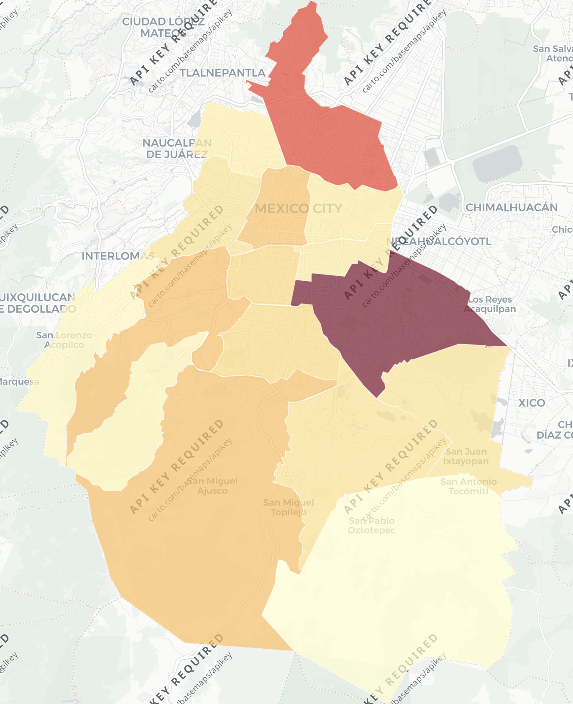
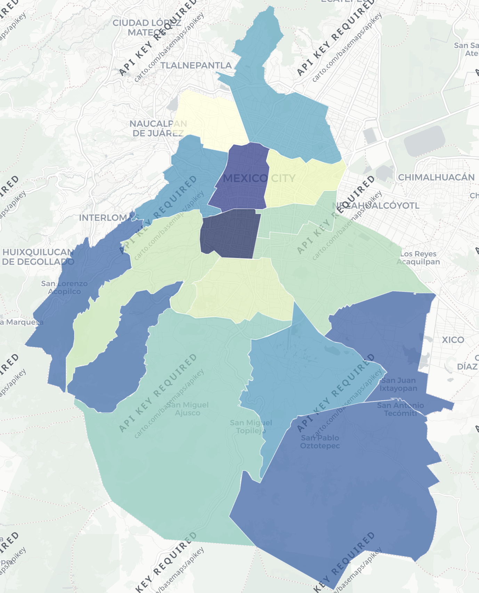

# Taller de Ciencia de Datos — Datos Espaciales

## DENUE y análisis espacial

**Entidad:** Ciudad de México  
**Giro económico:** Centros de acondicionamiento físico (gimnasios)  
**Fuente:** Directorio Estadístico Nacional de Unidades Económicas (DENUE), INEGI, mayo de 2026.

## Parte 1 — Réplica

### 1. Descarga y exploración de los datos

Para realizar el análisis se utilizó el DENUE correspondiente a la Ciudad de México, publicado por el INEGI en mayo de 2026. La base contiene 462,732 unidades económicas y 42 variables.

Para identificar los gimnasios se revisó la variable `nombre_act` y se identificaron dos códigos de actividad económica:

- `713943`: Centros de acondicionamiento físico del sector privado.
- `713944`: Centros de acondicionamiento físico del sector público.

En total se identificaron 2,275 establecimientos: 2,008 pertenecientes al sector privado y 267 al sector público.

### 2. Variables utilizadas

A partir del diccionario de datos del DENUE se seleccionaron las siguientes variables relevantes para el análisis:

- **`nom_estab`**: nombre comercial con el que se identifica o anuncia la unidad económica. En este análisis permite identificar cada gimnasio o centro de acondicionamiento físico.
- **`codigo_act`**: código que clasifica la actividad económica desarrollada por el establecimiento de acuerdo con el SCIAN. Se utilizó para seleccionar los centros de acondicionamiento físico.
- **`nombre_act`**: descripción de la actividad económica asociada al código SCIAN. Permite interpretar el giro al que pertenece cada establecimiento.
- **`municipio`**: nombre del municipio o demarcación territorial donde se encuentra la unidad económica. En la Ciudad de México permite agrupar los establecimientos por alcaldía.
- **`latitud`**: coordenada geográfica que indica la posición norte-sur del establecimiento y permite ubicarlo espacialmente.
- **`longitud`**: coordenada geográfica que indica la posición este-oeste del establecimiento y, junto con la latitud, permite representarlo en un mapa.

### 3. Revisión de calidad de los datos

Después de filtrar los códigos de actividad `713943` y `713944`, se obtuvieron 2,275 centros de acondicionamiento físico.

No se encontraron registros con latitud o longitud faltantes, por lo que los 2,275 establecimientos pueden utilizarse para el análisis espacial.

Respecto a los nombres de los establecimientos, se encontraron 69 nombres que aparecen más de una vez. Por ejemplo, "CLASES DE ZUMBA" aparece 12 veces, "GIMNASIO SIN NOMBRE" 10 veces y "ZUMBA" 9 veces. Estos registros no fueron eliminados, ya que compartir un nombre comercial no implica necesariamente que se trate de una observación duplicada; pueden corresponder a establecimientos distintos o a diferentes sucursales.

### 4. Unidades de negocio por alcaldía

La distribución de centros de acondicionamiento físico no es homogénea entre las alcaldías de la Ciudad de México. El mayor número de establecimientos se concentra en Iztapalapa y Gustavo A. Madero, mientras que Milpa Alta presenta el menor número.

| Alcaldía | Número de gimnasios |
|---|---:|
| Iztapalapa | 422 |
| Gustavo A. Madero | 303 |
| Álvaro Obregón | 170 |
| Tlalpan | 167 |
| Cuauhtémoc | 163 |
| Benito Juárez | 135 |
| Coyoacán | 134 |
| Xochimilco | 116 |
| Tláhuac | 111 |
| Miguel Hidalgo | 110 |
| Iztacalco | 94 |
| Venustiano Carranza | 93 |
| Azcapotzalco | 84 |
| La Magdalena Contreras | 69 |
| Cuajimalpa de Morelos | 61 |
| Milpa Alta | 43 |

En términos absolutos, Iztapalapa concentra el mayor número de centros de acondicionamiento físico, con 422 establecimientos, seguida por Gustavo A. Madero, con 303. En contraste, Milpa Alta registra únicamente 43 establecimientos.

Sin embargo, estos conteos no deben interpretarse todavía como una medida directa de disponibilidad o concentración de gimnasios, ya que las alcaldías tienen tamaños de población muy distintos. Por esta razón, en la segunda parte del análisis se comparará el número bruto de establecimientos con una medida normalizada por población.

### 5. Mapa de puntos

Para visualizar la distribución espacial de los centros de acondicionamiento físico en la Ciudad de México, se construyó un mapa interactivo de puntos utilizando `leaflet` en R. Cada punto representa uno de los 2,275 establecimientos identificados en el DENUE y se ubicó a partir de sus coordenadas de latitud y longitud.

El mapa permite consultar de manera interactiva el nombre del establecimiento, la actividad económica registrada y la alcaldía en la que se encuentra. Debido a que no se identificaron registros con coordenadas faltantes, fue posible representar la totalidad de los establecimientos seleccionados.

A partir de la distribución de los puntos se observa que los centros de acondicionamiento físico se encuentran distribuidos a lo largo de las 16 alcaldías, aunque visualmente existe una mayor concentración en las zonas con mayor densidad urbana. También se observan áreas con una presencia considerablemente menor de establecimientos, particularmente hacia algunas zonas periféricas de la ciudad.

Este primer mapa permite identificar patrones generales de localización, pero no es suficiente para determinar qué alcaldías cuentan con una mayor oferta relativa de gimnasios. Una mayor cantidad de puntos puede estar relacionada simplemente con una mayor población. Por ello, en la segunda parte del análisis se incorporará la población de cada alcaldía para comparar el número absoluto de establecimientos con una medida normalizada.

[Ver mapa interactivo](https://andres-padronqu.github.io/An-lisis-Datos-Espaciales/outputs/mapas/mapa_gimnasios_cdmx.html)

## Parte 2 — Mapa corópletico municipal normalizado

### 6. Cruce espacial por alcaldía

Para analizar la distribución de los centros de acondicionamiento físico a nivel de alcaldía, se utilizó la capa de Áreas Geoestadísticas Municipales (AGEM) del Marco Geoestadístico 2025 del INEGI para la Ciudad de México.

Los 2,275 establecimientos identificados en el DENUE fueron convertidos a objetos espaciales de tipo punto a partir de sus coordenadas de longitud y latitud. Posteriormente, se transformaron al mismo sistema de referencia de coordenadas utilizado por los polígonos del Marco Geoestadístico y se realizó un cruce espacial para identificar la alcaldía en la que se localiza cada establecimiento.

El cruce espacial permitió asignar una alcaldía a la totalidad de los 2,275 establecimientos, sin registros fuera de los polígonos de la Ciudad de México. Además, los conteos obtenidos mediante este procedimiento coincidieron con los obtenidos previamente utilizando la variable `municipio` del DENUE.

### 7. Distribución absoluta de gimnasios por alcaldía

A partir del cruce espacial se calculó el número de centros de acondicionamiento físico localizado dentro de cada una de las 16 alcaldías y se construyó un mapa coroplético utilizando el conteo absoluto de establecimientos.

El mapa muestra diferencias importantes en el número de establecimientos entre alcaldías. Iztapalapa presenta el mayor conteo, con 422 gimnasios, seguida por Gustavo A. Madero con 303. En contraste, Milpa Alta registra 43 establecimientos, el menor número entre las alcaldías de la Ciudad de México.

Sin embargo, el conteo absoluto está influido por el tamaño de la población de cada alcaldía. Por esta razón, una alcaldía con un número elevado de gimnasios no necesariamente presenta una mayor oferta relativa para sus habitantes. Para considerar estas diferencias, posteriormente se normalizará el número de establecimientos utilizando la población de cada alcaldía.

[Ver mapa interactivo](https://andres-padronqu.github.io/An-lisis-Datos-Espaciales/outputs/mapas/mapa_conteo_gimnasios.html)

### 8. Normalización por población

Para comparar la disponibilidad relativa de centros de acondicionamiento físico entre alcaldías, se incorporó información de población del Censo de Población y Vivienda 2020 del INEGI. Se utilizó la población total de cada alcaldía y se calculó el número de gimnasios por cada 10,000 habitantes mediante la siguiente expresión:

**Gimnasios por cada 10,000 habitantes = (Número de gimnasios / Población total) × 10,000**

La normalización modifica de manera importante el orden observado a partir de los conteos absolutos. Benito Juárez presenta la mayor tasa, con 3.11 gimnasios por cada 10,000 habitantes, seguida por Cuauhtémoc con 2.99, Tláhuac con 2.83, Milpa Alta con 2.82 y Cuajimalpa de Morelos con 2.80.

En contraste, algunas alcaldías que presentan un número elevado de establecimientos en términos absolutos descienden al considerar el tamaño de su población. Iztapalapa, por ejemplo, ocupa el primer lugar en número absoluto con 422 gimnasios, pero registra aproximadamente 2.30 gimnasios por cada 10,000 habitantes.

[Ver mapa interactivo](https://andres-padronqu.github.io/An-lisis-Datos-Espaciales/outputs/mapas/mapa_gimnasios_10000.html)

### 9. Comparación e interpretación de resultados

La comparación entre el número absoluto de gimnasios y la tasa por cada 10,000 habitantes muestra que el tamaño de la población modifica de manera importante la interpretación de la distribución de los establecimientos.

En términos absolutos, Iztapalapa ocupa el primer lugar con 422 gimnasios, seguida por Gustavo A. Madero con 303 y Álvaro Obregón con 170. Sin embargo, al normalizar por población, Iztapalapa desciende del primer al duodécimo lugar, con 2.30 gimnasios por cada 10,000 habitantes. De manera similar, Gustavo A. Madero pasa del segundo al noveno lugar y Álvaro Obregón del tercero al decimotercero.

El comportamiento contrario se observa en alcaldías con menor población. Benito Juárez pasa del sexto lugar en número absoluto al primer lugar en términos relativos, con 3.11 gimnasios por cada 10,000 habitantes. Cuauhtémoc pasa del quinto al segundo lugar, mientras que Tláhuac pasa del noveno al tercero. Destaca especialmente Milpa Alta, que a pesar de ocupar el último lugar en número absoluto, con 43 establecimientos, asciende al cuarto lugar después de normalizar por población, con 2.82 gimnasios por cada 10,000 habitantes. Cuajimalpa de Morelos presenta un comportamiento similar, al pasar del decimoquinto al quinto lugar.

Estos resultados muestran la importancia de considerar el tamaño de la población al comparar unidades geográficas. El conteo absoluto permite identificar las alcaldías donde se concentra el mayor número de establecimientos, mientras que la tasa por cada 10,000 habitantes permite comparar su oferta relativa respecto al número de habitantes. Por lo tanto, ambos mapas responden preguntas distintas y su análisis conjunto ofrece una visión más completa de la distribución espacial de los centros de acondicionamiento físico en la Ciudad de México.

Desde una perspectiva de toma de decisiones, estos resultados pueden utilizarse como un primer diagnóstico para identificar alcaldías con una oferta relativa alta o baja de centros de acondicionamiento físico. Por ejemplo, mientras Benito Juárez presenta la mayor cantidad de gimnasios por habitante, alcaldías como Azcapotzalco, Venustiano Carranza o Coyoacán muestran tasas relativamente menores. Para una empresa interesada en evaluar la apertura de un nuevo establecimiento, estas diferencias podrían utilizarse como un primer criterio para seleccionar zonas que requieran un análisis más detallado. Sin embargo, la tasa por población no es suficiente por sí sola para determinar una ubicación óptima, ya que también sería necesario considerar factores como ingreso, edad de la población, accesibilidad, precios, competencia cercana y distribución de los establecimientos dentro de cada alcaldía.

## 10. Referencias

Castro, C. (2026). *Datos espaciales* [Material de clase]. Seminario de Métodos Analíticos de la Empresa, Maestría en Ciencia de Datos, Instituto Tecnológico Autónomo de México (ITAM).

Castro, C. (2026). *Scripts y ejemplos de análisis de datos espaciales en R* [Material de clase]. Seminario de Métodos Analíticos de la Empresa, Maestría en Ciencia de Datos, Instituto Tecnológico Autónomo de México (ITAM).

Instituto Nacional de Estadística y Geografía (INEGI). (2026). *Directorio Estadístico Nacional de Unidades Económicas (DENUE), mayo de 2026*. INEGI.

Instituto Nacional de Estadística y Geografía (INEGI). (2025). *Marco Geoestadístico 2025. Áreas Geoestadísticas Municipales (AGEM), Ciudad de México*. INEGI.

Instituto Nacional de Estadística y Geografía (INEGI). (2020). *Censo de Población y Vivienda 2020. Principales resultados por localidad (ITER), Ciudad de México*. INEGI.