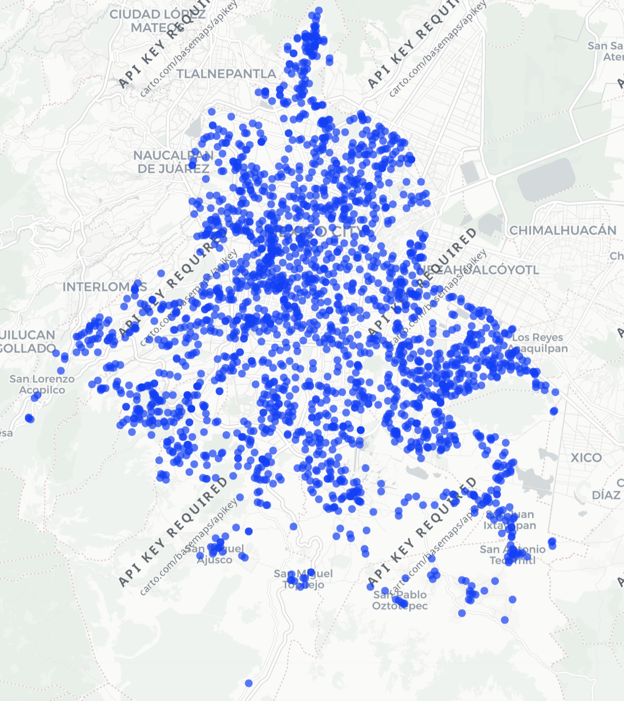

# Taller de Ciencia de Datos — Datos Espaciales

## DENUE y análisis espacial

**Entidad:** Ciudad de México  
**Giro económico:** Centros de acondicionamiento físico (gimnasios)  
**Fuente:** Directorio Estadístico Nacional de Unidades Económicas (DENUE), INEGI, mayo de 2026.

## Parte 1 — Réplica

### 1. Descarga y exploración de los datos

Para realizar el análisis se utilizó el DENUE correspondiente a la Ciudad de México, publicado por el INEGI en mayo de 2026. La base contiene 462,732 unidades económicas y 42 variables.

Para identificar los gimnasios se revisó la variable `nombre_act` y se identificaron dos códigos de actividad económica:

- `713943`: Centros de acondicionamiento físico del sector privado.
- `713944`: Centros de acondicionamiento físico del sector público.

En total se identificaron 2,275 establecimientos: 2,008 pertenecientes al sector privado y 267 al sector público.

### 2. Variables utilizadas

A partir del diccionario de datos del DENUE se seleccionaron las siguientes variables relevantes para el análisis:

- **`nom_estab`**: nombre comercial con el que se identifica o anuncia la unidad económica. En este análisis permite identificar cada gimnasio o centro de acondicionamiento físico.
- **`codigo_act`**: código que clasifica la actividad económica desarrollada por el establecimiento de acuerdo con el SCIAN. Se utilizó para seleccionar los centros de acondicionamiento físico.
- **`nombre_act`**: descripción de la actividad económica asociada al código SCIAN. Permite interpretar el giro al que pertenece cada establecimiento.
- **`municipio`**: nombre del municipio o demarcación territorial donde se encuentra la unidad económica. En la Ciudad de México permite agrupar los establecimientos por alcaldía.
- **`latitud`**: coordenada geográfica que indica la posición norte-sur del establecimiento y permite ubicarlo espacialmente.
- **`longitud`**: coordenada geográfica que indica la posición este-oeste del establecimiento y, junto con la latitud, permite representarlo en un mapa.

### 3. Revisión de calidad de los datos

Después de filtrar los códigos de actividad `713943` y `713944`, se obtuvieron 2,275 centros de acondicionamiento físico.

No se encontraron registros con latitud o longitud faltantes, por lo que los 2,275 establecimientos pueden utilizarse para el análisis espacial.

Respecto a los nombres de los establecimientos, se encontraron 69 nombres que aparecen más de una vez. Por ejemplo, "CLASES DE ZUMBA" aparece 12 veces, "GIMNASIO SIN NOMBRE" 10 veces y "ZUMBA" 9 veces. Estos registros no fueron eliminados, ya que compartir un nombre comercial no implica necesariamente que se trate de una observación duplicada; pueden corresponder a establecimientos distintos o a diferentes sucursales.

### 4. Unidades de negocio por alcaldía

La distribución de centros de acondicionamiento físico no es homogénea entre las alcaldías de la Ciudad de México. El mayor número de establecimientos se concentra en Iztapalapa y Gustavo A. Madero, mientras que Milpa Alta presenta el menor número.

| Alcaldía | Número de gimnasios |
|---|---:|
| Iztapalapa | 422 |
| Gustavo A. Madero | 303 |
| Álvaro Obregón | 170 |
| Tlalpan | 167 |
| Cuauhtémoc | 163 |
| Benito Juárez | 135 |
| Coyoacán | 134 |
| Xochimilco | 116 |
| Tláhuac | 111 |
| Miguel Hidalgo | 110 |
| Iztacalco | 94 |
| Venustiano Carranza | 93 |
| Azcapotzalco | 84 |
| La Magdalena Contreras | 69 |
| Cuajimalpa de Morelos | 61 |
| Milpa Alta | 43 |

En términos absolutos, Iztapalapa concentra el mayor número de centros de acondicionamiento físico, con 422 establecimientos, seguida por Gustavo A. Madero, con 303. En contraste, Milpa Alta registra únicamente 43 establecimientos.

Sin embargo, estos conteos no deben interpretarse todavía como una medida directa de disponibilidad o concentración de gimnasios, ya que las alcaldías tienen tamaños de población muy distintos. Por esta razón, en la segunda parte del análisis se comparará el número bruto de establecimientos con una medida normalizada por población.

### 5. Mapa de puntos

Para visualizar la distribución espacial de los centros de acondicionamiento físico en la Ciudad de México, se construyó un mapa interactivo de puntos utilizando `leaflet` en R. Cada punto representa uno de los 2,275 establecimientos identificados en el DENUE y se ubicó a partir de sus coordenadas de latitud y longitud.

El mapa permite consultar de manera interactiva el nombre del establecimiento, la actividad económica registrada y la alcaldía en la que se encuentra. Debido a que no se identificaron registros con coordenadas faltantes, fue posible representar la totalidad de los establecimientos seleccionados.

A partir de la distribución de los puntos se observa que los centros de acondicionamiento físico se encuentran distribuidos a lo largo de las 16 alcaldías, aunque visualmente existe una mayor concentración en las zonas con mayor densidad urbana. También se observan áreas con una presencia considerablemente menor de establecimientos, particularmente hacia algunas zonas periféricas de la ciudad.

Este primer mapa permite identificar patrones generales de localización, pero no es suficiente para determinar qué alcaldías cuentan con una mayor oferta relativa de gimnasios. Una mayor cantidad de puntos puede estar relacionada simplemente con una mayor población. Por ello, en la segunda parte del análisis se incorporará la población de cada alcaldía para comparar el número absoluto de establecimientos con una medida normalizada.

[Ver mapa interactivo](../outputs/mapas/mapa_gimnasios_cdmx.html)